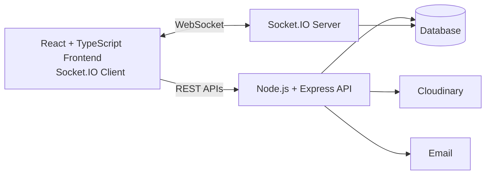
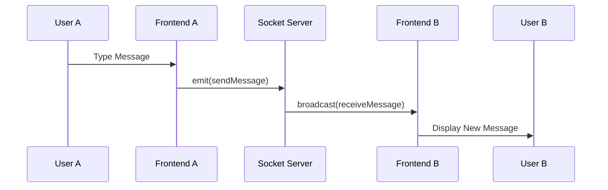
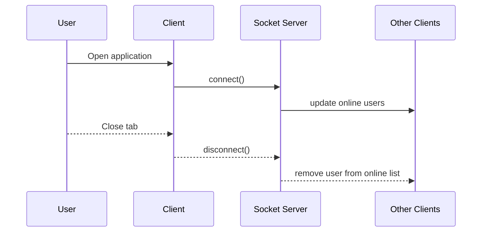

# Real-Time Chat Application
A full-stack real-time chat application built using using React, TypeScript, Node.js, Express, Socket.IO, MongoDB and Cloudinary.

## Features
- ⚡ Real-time Messaging via Socket.io
- 🔐 JWT Authentication (no 3rd-party auth)
- 🟢 Online/Offline Presence Indicators
- 📷 Image uploads via Cloudinary
- 📨 Welcome Emails on Signup (Resend)
- 🎨 Beautiful UI with React, Tailwind CSS & DaisyUI
- 🧠 Zustand for State Management
- ☁️ Render deployment

## 🚀 Features
- **Real-Time Communication**: Instant message delivery and receipt utilizing bi-directional WebSockets (`Socket.io`).
- **Live Activity Tracking**: Real-time indicators displaying users' current online/offline statuses.
- **Media Uploading**: Seamless profile picture updates with automated image optimization managed through Cloudinary.
- **Modern UI**: A responsive, frontend constructed with React, TypeScript, and Tailwind CSS.
- **Secure Authentication**: Verification powered by JSON Web Tokens (JWT) stored in HTTP-only cookies.

## 🏗️ Architecture & System Flows
## High Level Architecture



## Message Flow


## Online Status Flow


## .env Setup
```
PORT=3000
MONGO_URI=your_mongo_uri_here

NODE_ENV=development

JWT_SECRET=your_jwt_secret

RESEND_API_KEY=your_resend_api_key
EMAIL_FROM=your_email_from_address
EMAIL_FROM_NAME=your_email_from_name

CLIENT_URL=http://localhost:5173

CLOUDINARY_CLOUD_NAME=your_cloudinary_cloud_name
CLOUDINARY_API_KEY=your_cloudinary_api_key
CLOUDINARY_API_SECRET=your_cloudinary_api_secret
```

## Run the Backend
```
cd backend
npm install
npm run dev
```

## Run the Frontend
```
cd frontend
npm install
npm run dev
```
